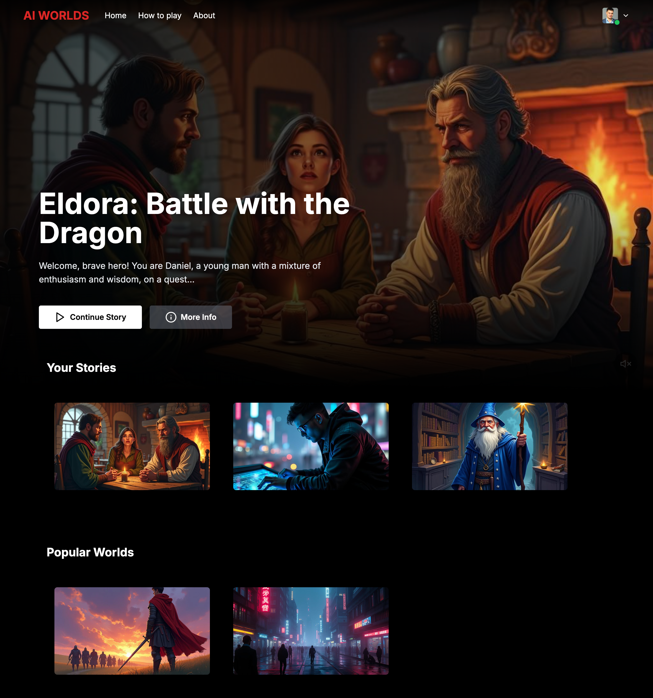
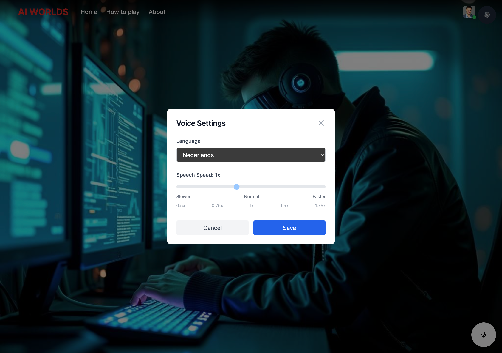
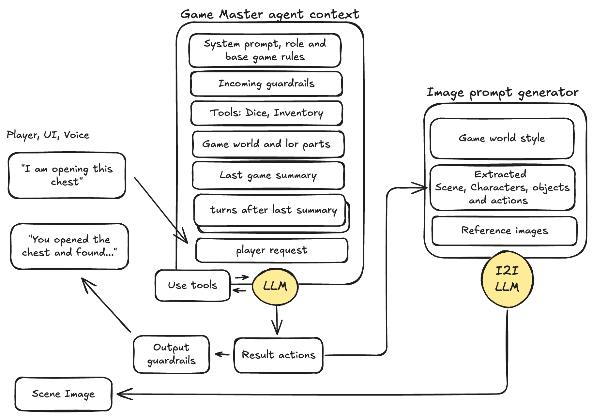

# Real-time Voice Agent for AI Worlds

**Part of the aiworlds.online ecosystem**

## About aiworlds.online Platform

**aiworlds.online** is an experimental platform for testing and applying cutting-edge AI technologies in interactive experiences. The platform focuses on creating immersive voice-driven RPG games that combine multiple AI services into seamless real-time interactions.

### Platform Components

The aiworlds.online ecosystem consists of several interconnected services:

- **lk-agent** (this repository) - Real-time voice agent for AI-powered RPG game narration
- **story-api** - Backend API for game data, user management, and turn persistence
- **story-front** - Frontend web application for game interface and visualization
- **StoryImageGen** - AI-powered image generation service for scene visualization

## Project Overview

**lk-agent** is a real-time voice agent built on [LiveKit Agents SDK](https://docs.livekit.io/agents/) that powers interactive RPG experiences with AI-driven game master narration. The agent processes player voice input, generates contextual responses using LLM, and delivers natural speech output in multiple languages.


*aiworlds.online platform home screen with game world selection*

Try Live Demo [AIWorlds.online](https://AIWorlds.online/)

### Key Features

- **Real-time Voice Interaction** - Seamless voice-to-voice communication with sub-second latency
- **Multi-language Support** - Full support for English, Russian, Dutch, French, and Spanish
- **Dynamic Language Switching** - Change language on-the-fly during active sessions
- **AI Game Master** - Context-aware RPG narration powered by GPT-4o
- **Scene Visualization** - Automatic generation of scene images for each turn
- **Intelligent Context Management** - RAG-powered world lore integration with conversation summaries
- **Persistent Game State** - Integration with backend API for game progression tracking


*Dynamic language and speech speed settings available during gameplay*

## Architecture

### Voice Processing Pipeline

The agent implements a sophisticated voice processing pipeline:

```
┌─────────────┐     ┌──────────────┐     ┌──────────────┐     ┌──────────────┐
│   Player    │────▶│     VAD      │────▶│     STT      │────▶│     LLM      │
│   Audio     │     │   (Silero)   │     │  (Deepgram)  │     │  (GPT-4o)    │
└─────────────┘     └──────────────┘     └──────────────┘     └──────────────┘
                                                                       │
                                                                       ▼
┌─────────────┐     ┌──────────────┐     ┌──────────────┐     ┌──────────────┐
│   Player    │◀────│     TTS      │◀────│  Turn Detect │◀────│  Response    │
│   Audio     │     │  (Cartesia)  │     │(Multilingual)│     │  Generation  │
└─────────────┘     └──────────────┘     └──────────────┘     └──────────────┘
```

#### Pipeline Components

1. **VAD (Voice Activity Detection)** - Silero VAD detects when player starts/stops speaking
2. **STT (Speech-to-Text)** - Deepgram nova-3 model with multilingual support
3. **LLM (Language Model)** - OpenAI GPT-4o generates contextual RPG responses
4. **Turn Detection** - Multilingual model manages conversation flow
5. **TTS (Text-to-Speech)** - Cartesia sonic-2 synthesizes natural voice output

### System Architecture

```
┌─────────────────────────────────────────────────────────────────┐
│                        aiworlds.online                          │
│                                                                 │
│  ┌────────────────┐      ┌───────────────┐      ┌──────────┐    │
│  │  story-front   │◀────▶│   lk-agent    │◀────▶│story-api │    │
│  │   (Web UI)     │      │ (Voice Agent) │      │(Backend) │    │
│  └────────────────┘      └───────────────┘      └──────────┘    │
│         │                        │                     │        │
│         │                        │                     │        │
│         │                        ▼                     │        │
│         │              ┌──────────────────┐            │        │
│         └─────────────▶│ StoryImageGen    │◀───────────┘        │
│                        │ (Image AI)       │                     │
│                        └──────────────────┘                     │
│                                                                 │
│  ┌──────────────────────────────────────────────────────────┐   │
│  │               LiveKit Server (Real-time Media)           │   │
│  └──────────────────────────────────────────────────────────┘   │
└─────────────────────────────────────────────────────────────────┘
```

### Data Flow

1. **Game Initialization** - Agent fetches game data from story-api
2. **Voice Input** - Player speaks, audio processed through VAD → STT
3. **Context Building** - Game state + conversation history + player input
4. **Response Generation** - LLM generates RPG narration
5. **Image Generation** - StoryImageGen creates scene visualization (async)
6. **Voice Output** - TTS synthesizes response in selected language
7. **State Persistence** - Turn saved to story-api with image URL

## Technology Stack

### Core Technologies

- **Framework**: [LiveKit Agents SDK 1.x](https://docs.livekit.io/agents/)
- **Language**: Python 3.11+
- **Real-time Media**: LiveKit Cloud/Server

### AI Services Integration

| Component | Provider | Model | Purpose |
|-----------|----------|-------|---------|
| STT | Deepgram | nova-3 | Speech recognition with multilingual support |
| LLM | OpenAI | gpt-4o | RPG game master responses |
| TTS | Cartesia | sonic-2 | Natural voice synthesis (5 languages) |
| VAD | Silero | - | Voice activity detection |
| Image Gen | Custom | Stable Diffusion | Scene visualization |

## Context Management System

The agent employs a sophisticated context management system to maintain coherent and immersive RPG narratives across extended gameplay sessions.

### LLM Context Window Structure



Each interaction with the LLM includes carefully structured context:

1. **System Prompt** - Game master instructions with role, rules, and response style guidelines
2. **World Lore** - Base description of the selected game world's setting, history, and atmosphere
3. **Latest Game Summary** - Compressed narrative of previous gameplay (generated every 6 turns)
4. **Turn History** - Detailed conversation history since the last summary
5. **RAG-Enhanced World Details** - Relevant chunks from detailed world lore retrieved based on current context

This hierarchical approach ensures the AI has comprehensive context while staying within token limits.

### Image Generation Context

A separate context pipeline manages scene visualization:

- **Chat History Analysis** - Current GM response and recent player actions
- **Character Appearance** - Persistent visual description of the player's character
- **Illustration Style** - Game-specific art style prompt for visual consistency
- **Scene Context** - Extracted key visual elements from the current narrative moment

The StoryImageGen service processes this context to generate contextually relevant scene images that match the game's aesthetic and current narrative state.

### Context Optimization

- **Automatic Summarization** - Every 6 turns, detailed history is compressed into narrative summaries
- **Smart Context Pruning** - Old turn history is replaced with summaries to prevent token overflow
- **RAG Integration** - Only relevant world lore chunks are included based on current gameplay
- **Final Session Summary** - Complete game session is summarized on disconnect for next session continuity

## Features in Development

### Multiplayer Mode (Team Games)

The platform is actively developing support for collaborative RPG experiences:

- **Multi-user Sessions** - Multiple players in the same game room
- **Shared World State** - Synchronized game progression across all participants
- **Turn Management** - Coordinated player turn system for group interactions
- **Team Dynamics** - AI game master adapts narration for group decision-making
- **Individual Voice Channels** - Separate voice processing per player while maintaining shared context

This feature will enable cooperative storytelling where multiple players can interact with the same AI game master in real-time.

---

**Built with LiveKit Agents SDK | Part of aiworlds.online ecosystem**
